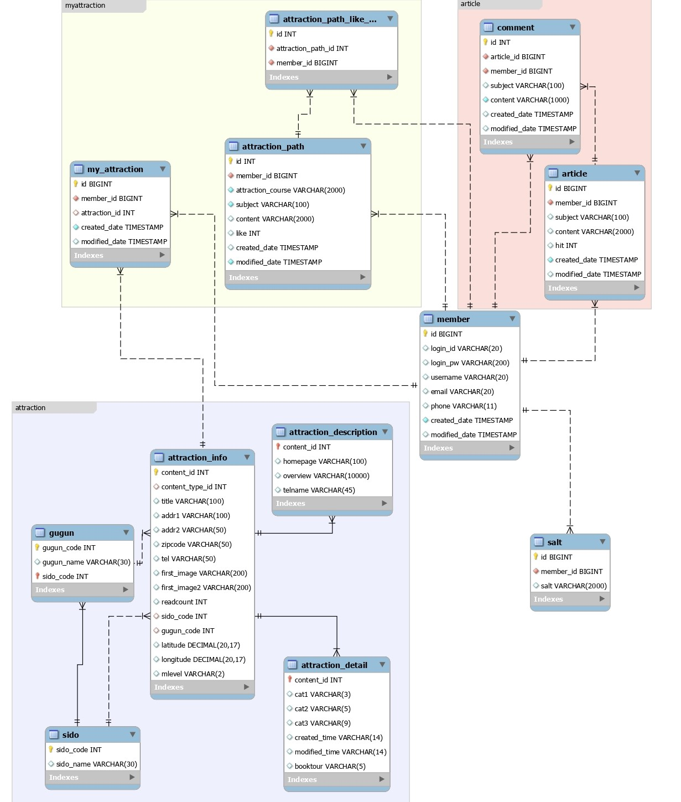
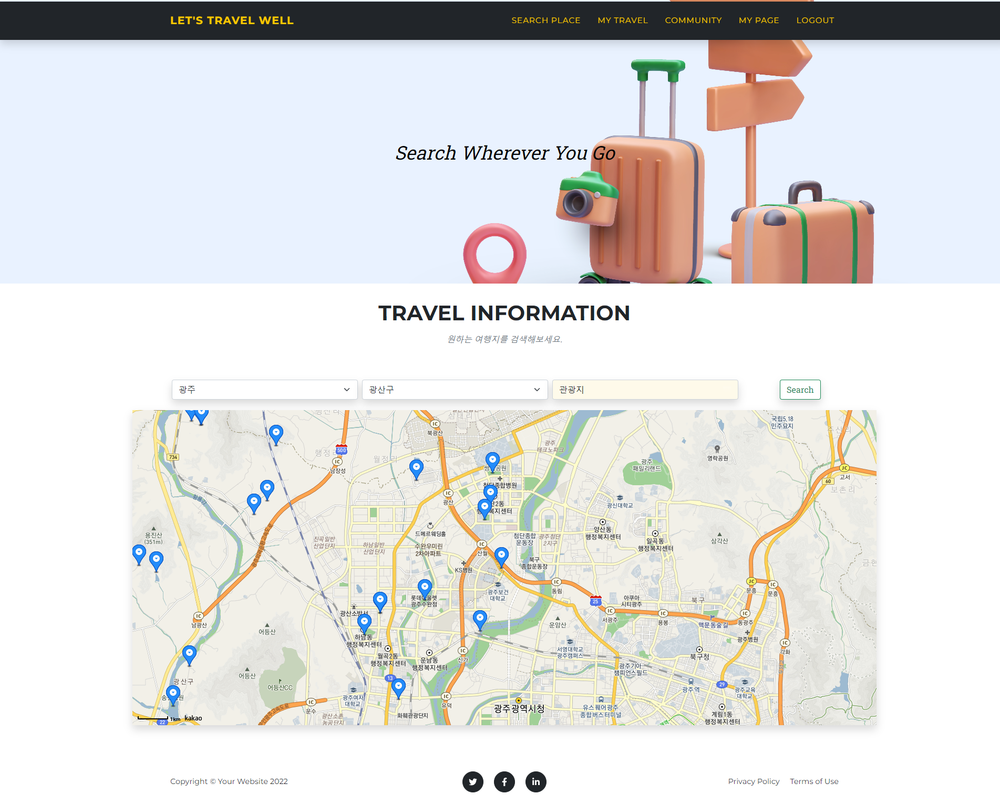
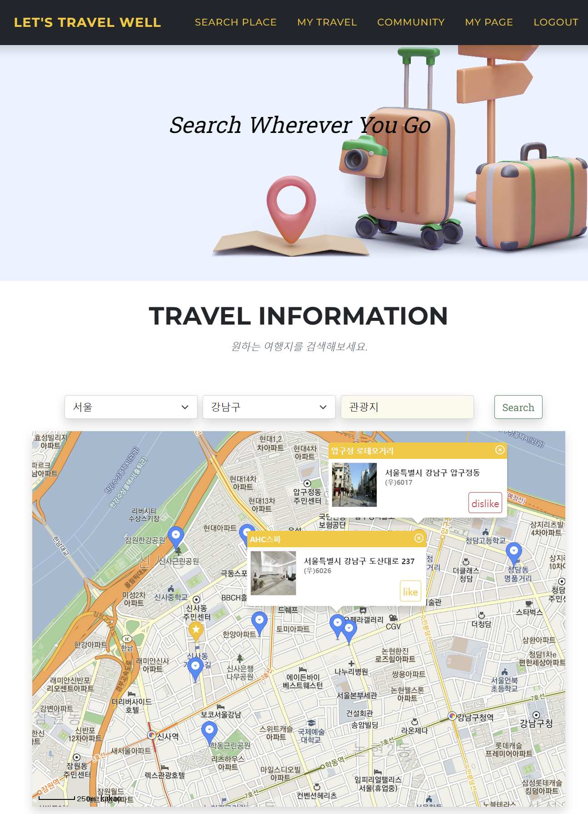
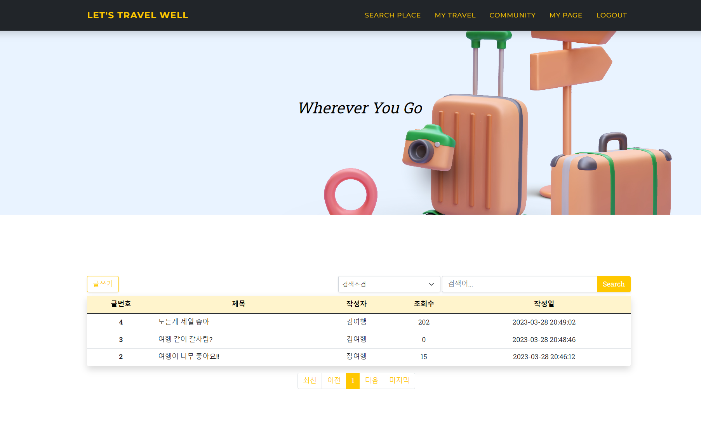
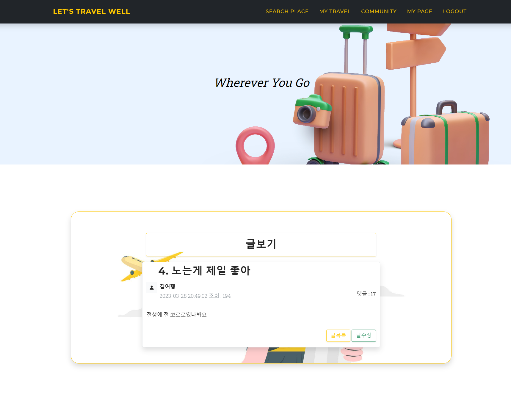
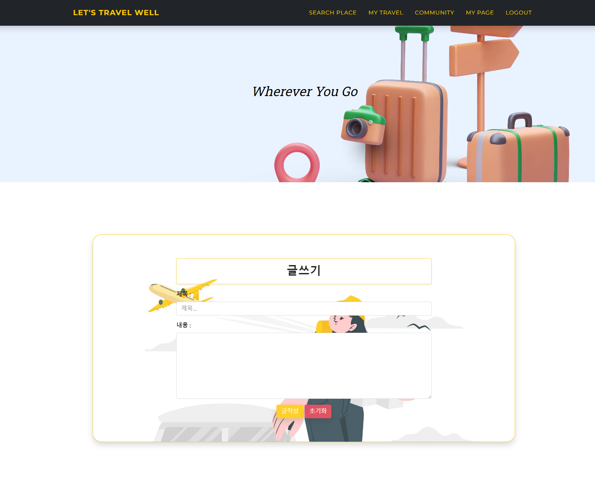
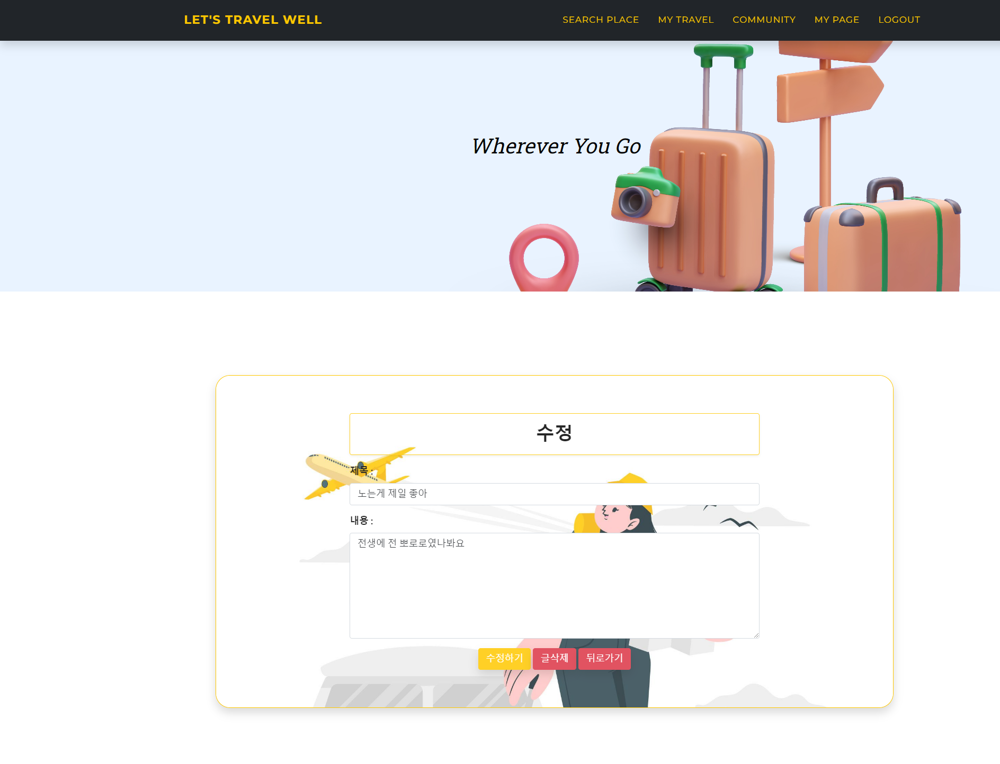

# 🚢 Lets-Travel-Well-Servlet 🚗

✈ 사용자 기반 추천을 통해 한국의 다양한 관광지, 먹거리, 축제, 행사 등을 검색할 수 있는 추천 기반 지역 관광 소개 페이지 ✈

## ✅ ERD 

## ✅ Main Page

Lets Travel Well 사이트의 추구하는 목적과 세부 설명을 담고 있으며, 빠르게 지역 정보를 검색할 수 있는 버튼(`Search Place` 버튼)을 제공함으로 사용자의 UX 를 고려한 메인 페이지입니다.

## ✅ Search Place Page

검색 조건에 따른 관광지 정보를 지도와 리스트로 표시해줌으로써 사용자가 편리하게 검색하여 각종 관광지 정보에 대해 조회할 수 있도록 기능을 제공해주는 페이지입니다.

- 검색 조건: 지역별, 시군별, 컨텐츠별 조회가 가능하며 검색조건을 지정하지 않는 경우 위치 기반 주변 관광지의 모든 정보를 조회할 수 있습니다.

- 로그인한 사용자는 여러 관광지 정보중 자신이 원하는 관광지를 scrap할 수 있습니다.
- scrap 한 관광지 정보는 My Travel 페이지에서 조회할 수 있습니다.
- scrap한 관광지를 scrap 취소할 수 있습니다.

## ✅ My Travle page

사용자가 scrap 한 관광지 정보를 조회하며, 스크랩한 관광지들 중 최단 경로를 구할 관광지를 선택하여, 최단 경로를 조회할 수 있는 페이지입니다.

- 스크랩한 관광지 정보를 조회할 수 있습니다.
- 최단 경로를 구하기 위해 여러 관광지를 선택할 수 있습니다.

## ✅ Login Page

사용자의 아이디와 비밀번호를 입력받아서 로그인 하는 페이지입니다.

## ✅ Sign Up Page

사용자의 이름, 아이디, 비밀번호, 비밀번호 확인을 입력받아서 회원가입하는 페이집니다.

- 아이디의 check 버튼으로 아이디 중복 확인을 할 수 있습니다.
- 전화번호는 Format을 지켜서 입력해야합니다.
- 비밀번호는 입력 시 암호화되어 저장됩니다.

  

## ✅ My page

사용자의 이름, 아이디를 나타내는 마이페이지입니다.

- Modify 버튼 클릭시 회원 정보를 수정할 수 있습니다.

## ✅ Community Page

사용자들이 작성한 게시글을 조회할 수 있는 페이지입니다.

- 페이지네이션 적용으로 한 페이지당 20개의 게시글을 볼 수 있습니다.
- 글번호, 제목, 작성자를 조건으로 검색을 할 수 있습니다.
- 클릭시 해당 게시글의 상세 정보를 볼 수 있습니다.

## ✅ Community View Page

게시글 상세 정보를 보여주는 페이지입니다.

- 로그인한 사용자와 글을 작성한 사용자가 일치하면 수정페이지로 갈 수 있습니다.

## ✅ Community Write Page

게시글을 삭제할 수 있는 페이지입니다.

- 게시글의 제목과 내용을 입력하여서 새로운 글을 등록할 수 있습니다.

## ✅ Community Modify Page

게시글을 수정할 수 있는 페이지입니다.

- 로그인한 사용자와 글을 작성한 사용자가 일치하면 수정을 할 수 있습니다.
- 로그인한 사용자와 글을 작성한 사용자가 일치하면 삭제를 할 수 있습니다.

## ✅ 알고리즘 적용 기획서 모음

- [최단경로 알고리즘](./FEATURE1.md) 
- [암호화 알고리즘](./FEATURE2.md)
