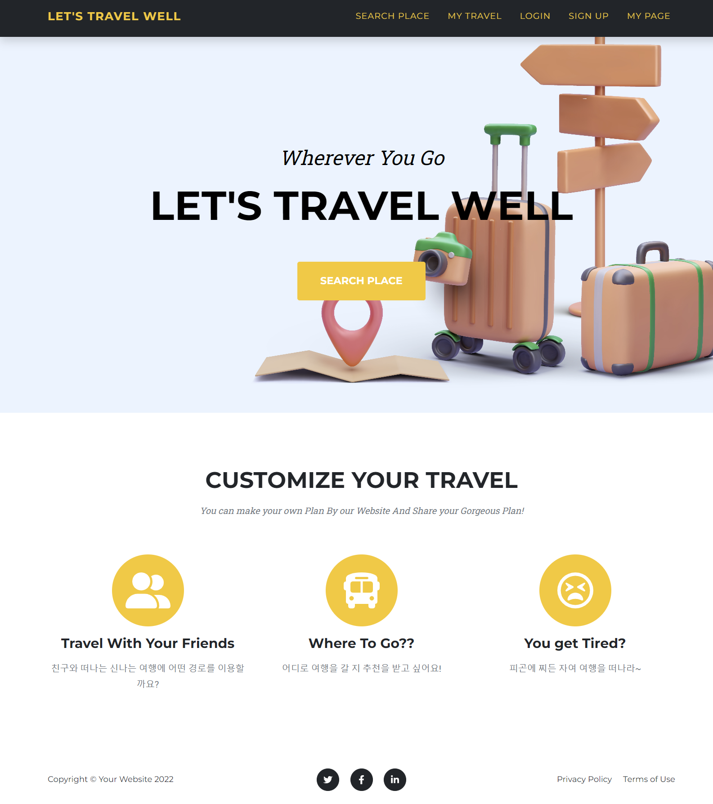

# 🚢 Lets-Travel-Well-Front 🚗

✈ 사용자 기반 추천을 통해 한국의 다양한 관광지, 먹거리, 축제, 행사 등을 검색할 수 있는 추천 기반 지역 관광 소개 페이지 ✈

## ✅ Main Page

Lets Travel Well 사이트의 추구하는 목적과 세부 설명을 담고 있으며, 빠르게 지역 정보를 검색할 수 있는 버튼(`Search Place` 버튼)을 제공함으로 사용자의 UX 를 고려한 메인 페이지입니다.

## ✅ Search Place Page

검색 조건에 따른 관광지 정보를 지도와 리스트로 표시해줌으로써 사용자가 편리하게 검색하여 각종 관광지 정보에 대해 조회할 수 있도록 기능을 제공해주는 페이지입니다.

- 검색 조건: 지역별, 시군별, 컨텐츠별 조회가 가능하며 검색조건을 지정하지 않는 경우 위치 기반 주변 관광지의 모든 정보를 조회할 수 있습니다.

## ✅ My Travel

사용자가 저장한 추천 장소를 지도로 표시해줌으로써 다른 사용자들 간의 추천 장소를 조회하는 페이지 입니다.

다양한 사용자로부터 저장된 여행 장소를 현재 위치 기반 (사용자 검색 기반) 주변 장소를 추천해주는 페이지입니다.

- 사용자의 위치 주변의 다른 사용자들이 추천한 장소를 지도로 확인할 수 있습니다.
- 추천 받은 장소 클릭 시 해당 장소의 세부 정보를 확인할 수 있으며, 해당 장소를 포함하는 여행 경로를 추천받을 수 있습니다. (구현예정)

## ✅ Login Page

사용자의 아이디와 비밀번호를 입력받아서 로그인 하는 페이지입니다.

## ✅ Sign Up Page

사용자의 이름, 아이디, 비밀번호, 비밀번호 확인을 입력받아서 회원가입하는 페이집니다.

## ✅ My page

사용자의 이름, 아이디를 나타내는 마이페이지입니다. Modify 버튼 클릭시 회원 정보를 수정할 수 있습니다.

## ✅ Modify Page

사용자 이름, 아이디, 비밀번호를 입력받아서 회원정보를 수정하는 페이지입니다.

## ✅ Community Page

사용자들이 작성한 게시글을 조회할 수 있는 페이지입니다.

## ✅ Community Regist Page
